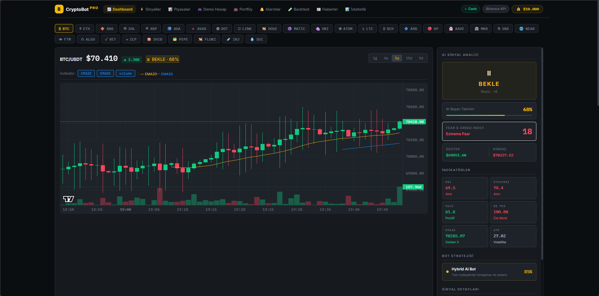
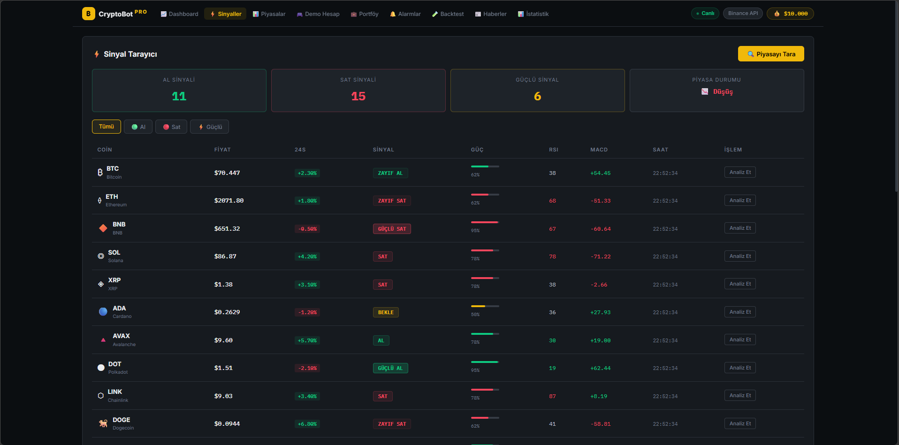
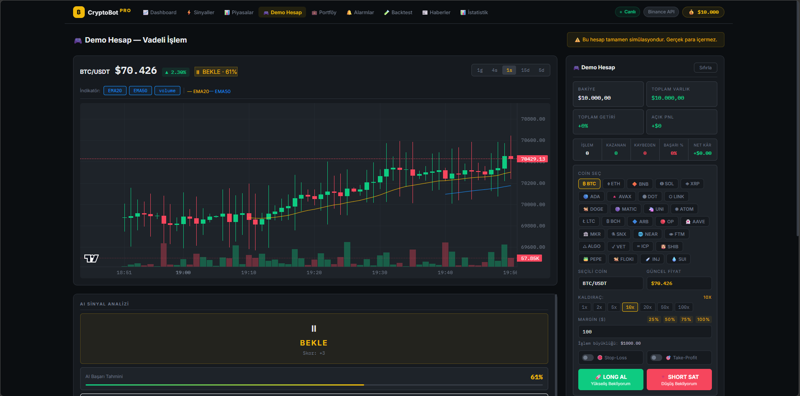
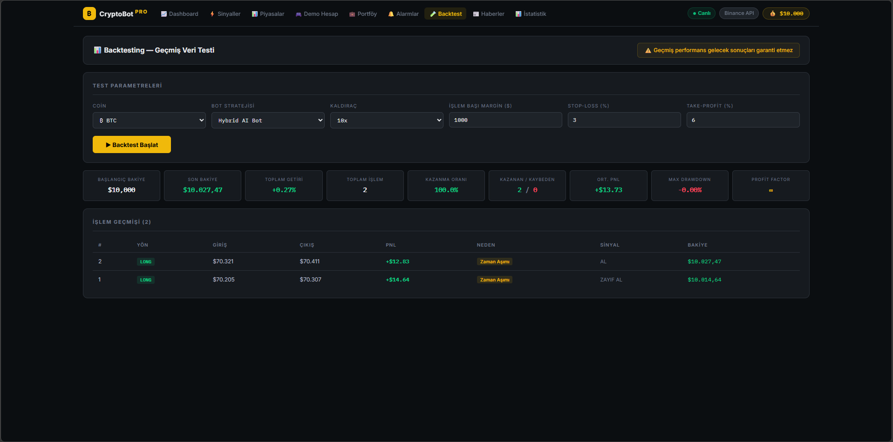
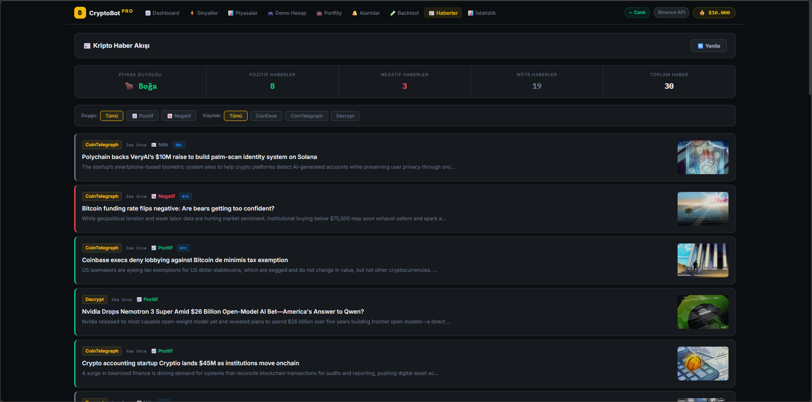

# CryptoBot Pro

Yapay zeka destekli kripto para analiz ve trading platformu. Gerçek zamanlı Binance API entegrasyonu ile teknik analiz, demo vadeli işlem ve portföy yönetimi sunar.

## Ekran Görüntüleri

### Dashboard


### AI Sinyal Tarayıcı


### Demo Hesap


### Backtest


### Haberler


## Proje İstatistikleri

| Özellik | Değer |
|---|---|
| Toplam Sayfa | 9 |
| Desteklenen Coin | 30 |
| Teknik İndikatör | 10+ |
| Bot Stratejisi | 4 |
| Zaman Dilimi | 5 |
| Veri Kaynağı | Binance API |

## Özellikler

- **AI Sinyal Motoru** — RSI, MACD, EMA, Bollinger Bands, StochRSI ve 10+ indikatör ile otomatik al/sat sinyali
- **Canlı Grafik** — Binance API ile gerçek zamanlı mum grafik ve EMA çizgileri
- **Demo Hesap** — 10.000 dolar sanal para ile kaldıraçlı Long/Short pozisyon, Stop-Loss ve Take-Profit
- **Backtest** — Geçmiş Binance verisiyle strateji testi
- **Portföy Takibi** — Coin bazlı kar/zarar hesaplama
- **Fiyat Alarmları** — Hedef fiyata ulaşınca tarayıcı bildirimi
- **Sinyal Tarayıcı** — 30 coini aynı anda analiz et
- **Haber Akışı** — CoinDesk, CoinTelegraph kaynaklı kripto haberleri
- **İstatistikler** — İşlem geçmişi, kazanma oranı, profit factor analizi

## AI Sinyal Motoru

Proje, sıfırdan yazılmış özel bir AI sinyal motoruna sahiptir. Motor 10 katmanlı analiz yaparak al/sat kararı üretir:

| Katman | İndikatör | Açıklama |
|---|---|---|
| 1 | RSI | Aşırı alım/satım bölgesi tespiti |
| 2 | Stochastic RSI | Momentum onayı |
| 3 | MACD | Trend yönü ve gücü |
| 4 | EMA Cross | 20/50/200 EMA dizilimi |
| 5 | Bollinger Bands | Volatilite ve bant pozisyonu |
| 6 | Trend Gücü | 20 bar ortalama karşılaştırması |
| 7 | Momentum | 10 bar fiyat değişimi |
| 8 | Fiyat Paterni | Çift dip, çift zirve, üçgen tespiti |
| 9 | Kırılım Analizi | Destek/direnç kırılımı |
| 10 | RSI Diverjansı | Boğa/ayı diverjans tespiti |

Sinyal tipleri: **GÜÇLÜ AL / AL / ZAYIF AL / BEKLE / ZAYIF SAT / SAT / GÜÇLÜ SAT**

## Teknolojiler

- React 18
- Binance REST API
- lightweight-charts
- IBM Plex Mono + Inter (Google Fonts)
- CSS Modules

## Kurulum
```bash
git clone https://github.com/canyildirici/cryptobot-pro.git
cd cryptobot-pro
npm install
npm start
```

Uygulama `http://localhost:3000` adresinde çalışır.

## Geliştirici

**Can Yıldırıcı**
- GitHub: [@canyildirici](https://github.com/canyildirici)

---

> Bu proje eğitim amaçlıdır. Gerçek yatırım tavsiyesi içermez.